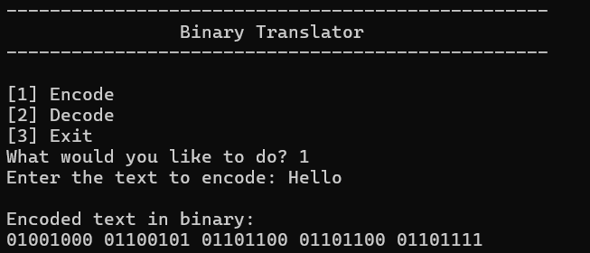
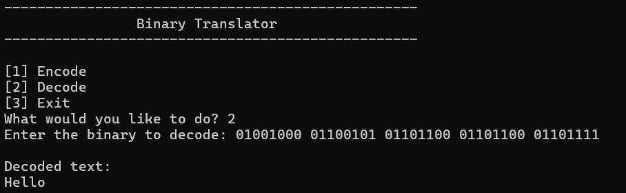

# Binary Translator

A simple console-based application that encodes text to binary and decodes binary back to text. 

## Features

- Encode any text input into binary representation.
- Decode binary input (space-separated) into readable text.
- Intuitive menu-driven interface.

## Requirements

- Python 3.7 or higher

## How to Run

1. Clone the repository:
   ```bash
   git clone https://github.com/vallz0/binary-translator.git
   cd binary-translator
2. Run the application:
   ```bash
   python main.py
   
## Usage

Once the program is running, you will see a menu with the following options:
1. **Encode:** Enter a string to convert it to binary.
2. **Decode:** Enter a space-separated binary string to convert it back to next
3. **Exit:** Close the application.

## Examples

#### Encode:

#### Decode:

